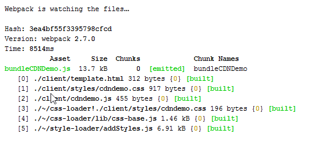

In our [last post](../conquer-your-dev-toolchain-2) I went through the gulp process we were implementing to watch our files and upload them into an appropriate SharePoint library so that we can test our work inside SharePoint regardless of if SharePoint was version 2007 or SharePoint Online. Now we’re going to take things further and formalize our process. One of the tools the SharePoint Framework (SPFx) uses is [Webpack](https://webpack.js.org/). Webpack’s main goal is to take the many files that you create as a developer and bundle them all together into one JavaScript file. The benefit of bundling is that we make one call to one file instead of multiple calls for many files which is more efficient (in general). What it also does is simplify the maintenance of your JavaScript references because instead of having 10’s of files you end up with as little as 1 file. Great, so how do we use it? My implementation separates the “webpacking” from the uploading. NPM via the package.json also allows some scripting and I take advantage of this by adding a watch task that triggers Webpack. Webpack then packages all my files and puts them in a build directory where I have my gulpfile watching via the process I described in the last post. I like this separation simply because it allows me to work on my packaging without having to have my “uploading” on. But of course, there is a way you could combine them all into one step, it's just not something I'm going to cover. To use Webpack we’re going to have to modify our package.json with a few more packages as well as add our build task. To your devDependencies add the following packages (reminder that these versions are relevant to the time of posting and will work together, depending on when you do this you may want upgrade to a more current version):

```json
"webpack": "~2.7.0",
"html-loader": "~0.4.5",
"css-loader": "~0.26.4",
"style-loader": "~0.13.2"
```

Then, still in the package.json file, right above the devDependencies section add the following scripts section:

```json
"scripts": {
  "build": "webpack"
},
```

| | |
| -- | -- |
| [Webpack](https://webpack.js.org/) | Bundling tool |
| [html-loader](https://webpack.js.org/loaders/html-loader/) | Allows Webpack to bundle your html into the js file. |
| [css-loader](https://webpack.js.org/loaders/css-loader/) | Helps Webpack bundle by importing your css and resolving any urls. |
| [style-loader](https://webpack.js.org/loaders/style-loader/) | Helps Webpack insert the css styles into the page. |

After updating your node\_modules by running “npm i”, then we need to add a new file called webpack.config.js. Below is an example config file that includes the most basic version of what the Webpack configuration will need to create a bundle.

```javascript
var webpack = require('webpack');

module.exports = {
    //entry can be an array and an include multiple files
    entry: {
        bundleCDNDemo: "./client/cdndemo.js"
    },
    output: {
        path: '/code/Public-Samples/CDNDemoWebpackTS/build/',
        filename: "\[name\].js",
        publicPath: '/'
    },
    module: {
        rules: \[
            {
                test: /\\.css$/,
                exclude: /node\_modules/,
                loader: \["style-loader", "css-loader"\]
            },
            {
                test: /\\.html$/,
                exclude: /node\_modules/,
                loader: "html-loader"
            }
        \]
    },
    externals: {
        angular: 'angular',
        Sympraxis: 'Sympraxis'
    },
    watch: true
};
```

Let’s go section by section through this an explain what’s happening. I’m keeping this simple so that you have the general idea, and am providing links to the documentation so you can do more research yourself to extend things.

| | |
| -- | -- |
| [entry](https://github.com/webpack/docs/wiki/configuration#entry) | This is an array of files that tell Webpack what to bundle. If you chain all of your files together using imports/require then you only need the starting point, otherwise you will need to reference all the files you want bundled. More on this below. |
| [output](https://github.com/webpack/docs/wiki/configuration#output) | Configures how and where you’re bundled file(s) will be put. |
| [module](https://github.com/webpack/docs/wiki/configuration#module) | Configures the bundling rules for how it handles different file types, etc. |
| [externals](https://github.com/webpack/docs/wiki/configuration#module) | Indicates dependencies that should not be bundled. |
| [watch](https://github.com/webpack/docs/wiki/configuration#watch) | Tells Webpack to watch for changes and re-bundle. |

## Referencing all your code

If we go look at cdndemo.js (which is the entry point for my angular application) we’re going to see import statements at the top. In this case I only have one JavaScript file, so I have no other references to JavaScript files, but I do have an html file and my css file. By using import Webpack knows that it needs to bundle those two files into its final file. Note too that I'm importing the html file into a variable that I then reference in the AngularJS component's template property.

```javascript
import cdndemoTemplate from './template.html';
import './styles/cdndemo.css';

angular.module('CDNDemo', \[\]).component('cdnDemo', {
      template: cdndemoTemplate,
      controllerAs: 'vm',
      controller: function () {
        this.title = "My CDN Demo with Webpack";
        console.log("CDN Demo Loading");
        this.$onInit = function () {
          console.log("CDN Demo Loaded");
        };
      }
    }
  );
```

So, I’m going to make a fairly quick comment here about require vs import. If you know the difference already then, this section won’t be pertinent and probably this blog series isn’t either. Basically, there is the old way and the new way to include modules in code. The old way was provided by NodeJS and is called _require_. Require lets you load your modules dynamically so, in other words, wherever the require appears in code is where/when the module is loaded. The new way, introduced in ES2015 was to use explicit _import_ statements which cannot be loaded dynamically. To make use of a Webpack feature called tree shaking effectively you need to use import. If you don’t need tree shaking or it’s not important to you then require is probably fine if you want to include large files with many modules in them and only have Webpack bundle the modules that you use out of those files (instead of the whole file) then import is more what you’re looking for. I think this means a lot more when you’re working with typescript but that’s just my opinion. Anyway, this is a more advanced development style and so I’m not looking to debate the pros and cons of one vs the other. I primarily want to make people who are new to this style of development aware there are two different ways of referencing the modules you need and that you should take time and learn more about them. A good introductory post on this subject comes from Jake Carson Zerrer [Webpack, import, require and you](https://insights.untapt.com/webpack-import-require-and-you-3fd7f5ea93c0)

## Start it Up

So now that we’re ready to go, I will start my "gulp watch" task first. Then I will start a second command window and start "npm run build" which will start the Webpack process. You will see that the system will then packages up all the files you referenced into in this case one bundled file.



## Loading it on the page

In my case my application uses AngularJS so for me my final step is to get my bundle loading on the SharePoint page. For that I’m using an angular component, so I would create either an html file with the following code or put the following code into a script editor web part. Note I’m using the [Widget Wrangler](https://github.com/Widget-Wrangler/ww) (WW), you do not have to do this, you could simply put 2 script tags that reference _angular.min.js_ and then the bundleCDNDemo.js before the div tag and remove the inline script tag that references the WW.

```html
<div>
    <cdn-demo></cdn-demo>
    <script type="text/javascript" src="/sites/cdn/Code/pnp-ww.min.js" 
        ww-appName="CDNDemo" 
        ww-appType="Angular"
        ww-appScripts='[{"src": "https://cdnjs.cloudflare.com/ajax/libs/angular.js/1.6.1/angular.min.js", "priority":0},
                        {"src": "~/CDNWebpack/bundleCDNDemo.js", "priority":1}
        ]'>
    </script> 
</div>
```

Hopefully, this was a clear explanation of how to add Webpack to your toolchain. Up next, we’re going to advance a few steps further and discuss how to add TypeScript, SCSS, and beyond.
