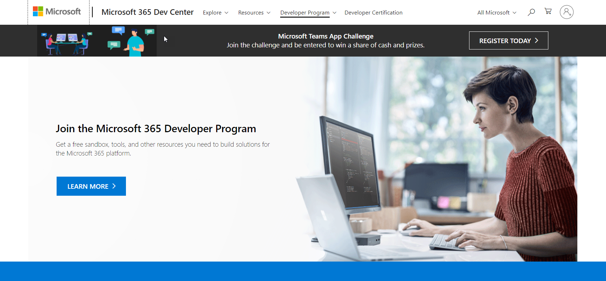
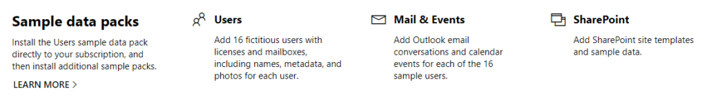

When someone says to you, they are using their “dev tenant” what they’re probably referring to is their personal development “sandbox” they received as part of joining the Microsoft 365 developer program.

By visiting [Developer Program - Microsoft 365](https://developer.microsoft.com/en-us/microsoft-365/dev-program) and selecting “Join Now” you’ll be walked through a wizard that will help you provision your very own Microsoft 365 tenant. You can see the details [here](https://developer.microsoft.com/en-us/microsoft-365/dev-program#Subscription), but the general idea is that you’ll have a tenant, where you get to be the omnipotent global admin, with 25 E5 Microsoft 365 licenses available to you that allow you to build out and test various scenarios within the ecosystem. 25 E5 licenses is a lot of horsepower to begin building out scenarios that mix the various tools of Microsoft 365 tenant (SharePoint, Teams, OneDrive, PowerApps, PowerAutomate, etc) into solutions for your “customers”. Although I know many people who advocate and joke about “build it in production”, the reality is that doing so is invasive and can have catastrophic consequences. As with many things you need to weigh the pros and the cons but the ability to fully realize and test your solutions in a “safe space” is powerful and can make you try things you might not if you’re worried about bringing down production. Better yet, if you continue to use the tenant, every 90 days it will auto renew so that you never have to worry about losing your work in progress. In addition, for those that work with Microsoft 365 every day the ability to keep up with what’s going on, what’s changing, and how to best implement your ideas is priceless. You can keep up with the status of your subscription by visiting the [Dashboard - Microsoft 365 Dev Center](https://developer.microsoft.com/en-us/microsoft-365/profile) page.

## Understanding the relationship between Azure and a “Tenant”

When building in the cloud we developers no longer have the same access to the “server” as we may be used to. The way we architect solutions for SaaS solutions has changed significantly and many people are aware that Azure provides various cloud-based resources to help with the automation scenarios that were lost when we left “on-prem”. It’s important to understand that each Microsoft 365 tenant has an equivalent Azure Active Directory (AAD) associated with it, including your brand-new shiny dev tenant. So, when you log into Azure the first time you need to be logging in with a global administrator account for your dev tenant. Once you are in Azure you then need to make sure you have a Subscription set up that is associated with that Azure Active Directory instance that is related to your dev tenant. By doing so you are effectively simulating what most production scenarios look like.\* If you already have an Azure subscription you use for development purposes, but it’s not associated with your dev tenant, you can change it. The ever-talented [Laura Kokkarinen](https://twitter.com/LauraKokkarinen) has a wonderful blog post ([How to use the complimentary Azure credits in a Microsoft 365 dev tenant — step by step)](https://laurakokkarinen.com/how-to-use-the-complimentary-azure-credits-in-a-microsoft-365-developer-tenant-step-by-step/) that covers all the ways you might have azure credits and how to get them associated with your dev tenant. \*It should be said that many ISVs and other 3rd party software providers might be looking to build solutions that target multiple tenants and thereby their Azure subscription, although tied to AAD is not targeted for a single AAD.

## Sample Data

Another awesome feature of these developer subscriptions is the ability to seed the tenant with sample data packs. To do this all you have to do is go to your [Dashboard - Microsoft 365 Dev Center](https://developer.microsoft.com/en-us/microsoft-365/profile) page and click on the kind of data pack you would like to add. You must have the “Users” sample data pack first but then you can also add Mail and Events as well as SharePoint data.

By having these data packs, it can make testing various scenarios with your application significantly simpler as you can have up to twenty-five accounts playing distinct roles in your scenario.

## Dev Tenant vs "[Customer Digital Transform](https://cdx.transform.microsoft.com/)" Tenants

Something that may be confusing to some is the difference between the dev tenants and “Customer Digital Transform” tenants. The latter are Microsoft 365 tenants that you can provision if you are someone providing sales or guidance to customers using Microsoft 365. They are extremely useful as these tenants are fully scaled out demo environments that can help you quickly and effectively communicate how Microsoft 365 can benefit a customer and their specific needs. These tenants however have a limited lifespan (between 3 months and 1 year) and after that time the tenant is decommissioned and there is no way to get them back. So, although once you have one of these demo tenants you can deploy and develop inside them, as they are fully functional, just like Cinderella when times up, time is up! As we said earlier, if you’re actively using dev tenants, they will auto renew every 90 days. So, now that you're all up to speed, what are you waiting for?! Get your [dev tenant now](https://developer.microsoft.com/en-us/microsoft-365/dev-program) and get on your way to building some awesome solutions!

>This article was cross-posted on the [Microsoft 365 PnP Blog - Microsoft Tech community](https://techcommunity.microsoft.com/t5/microsoft-365-pnp-blog/what-is-a-dev-tenant-and-why-would-you-want-one/ba-p/2036610)
