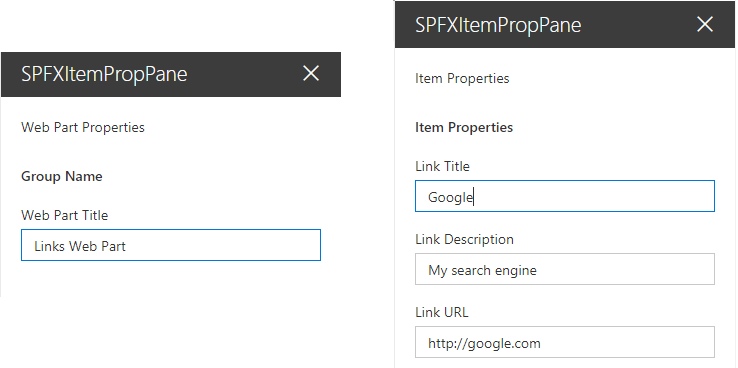
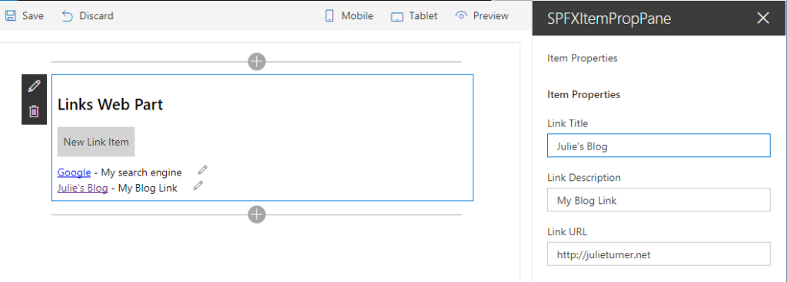

It’s a great privilege and great fun to work with the exceptional team at [Shire](https://www.shire.com/) that’s building a bleeding edge intranet to support their now 24,000 employees and growing. The team is exploring some very new territory and learning a lot along the way. During last weeks webinar, Microsoft’s [Mark Kashman](https://twitter.com/mkashman) promised we’d post some of the lessons learned in the project. It’s my pleasure to share with the greater world a tidbit of that knowledge in the form of how to create a property pane for an individual item, not just the web part using the SharePoint Framework (SPFx). [Bob German](https://twitter.com/bob1german) has also done several blog posts on the lessons learned, you can start reading them at [Bob German's Vantage Point](https://bob1german.com/2017/07/16/spfxofficedocs/).

In the custom web parts that are being built the UX team had decided upon a configuration that includes both a basic and advanced mode. The advanced mode, is sourcing the items to be displayed in the web part from a list. I’m not going to talk about that here, what I’m going to address is the idea of configuring all the items in the web part itself by the addition of a property panel specifically designed to add or edit one of those items. This is a separate property panel from the web part property panel in which you would configure overreaching properties of the web part, such as layout or title.



I’ve created a simple example (lacking in everything but the necessary functionality) to illustrate this concept by creating a webpart that displays a set of links. It doesn’t really matter how I render those links, could be buttons, unordered list, etc… the point is that I would have an array of link items that would be curated through the property panel not an external list. SharePoint’s own modern hero web part does this, so it shouldn’t be that hard, right?! It took our team member [Mike Tolly](https://twitter.com/mptolly) a good amount of reverse engineering to figure it out... and now his pain is our gain! Sorry Mike!!!



Within our web part we build a React component that has a set of properties. Those properties include things like _linkItems_ which is the array of items I want to show, and functions for working on that array like _editItem_, _deleteItem_, and _rearrangItems_, etc… Below is the code from this simple example where inside of the class definition for my web part I've added a property for the _activeIndex_ of the item being edited, updated the render function to create my SpfxItemPropPane component, and created two separate property pane configurations in _getWebPartPropertyPaneConfiguration_ and _getItemPropertyPaneConfiguration_. The real meat of the solution is in the protected _getPropertyPaneConfiguration_ function where I make the decision to render the item property pane if the property pane is being called from code vs being called by the web part edit button. Obviously if you wanted even more item property panes you could add additional logic and properties to determine which property pane you were calling.

```typescript
export default class SpfxItemPropPaneWebPart extends BaseClientSideWebPart {
  //Index of current item being edited.
  private \_activeIndex : number = -1;

  //Get & Set function for our activeIndex property.
  public get activeIndex() : number {
    return this.\_activeIndex;
  }
  public set activeIndex(v : number) {
    this.\_activeIndex = v;
  }

  protected get dataVersion(): Version {
    return Version.parse('1.0');
  }

  //Web parts render function
  public render(): void {
    //Declare the react component for the body of the web part
    const element: React.ReactElement = React.createElement(
      SpfxItemPropPane,
      {
        //Web parts title, set in the web part property pane
        title: this.properties.title,
        //Array of link items that I want to display in my web part.
        linkItems: this.properties.linkItems,
        //Function that calls the item property pane
        editItem: (index:number)=>{
          //If index is negative 1 then the add button was clicked.
          if(index===-1){
            this.properties.linkItems.push(new LinksItem("Link"));
            index = this.properties.linkItems.length-1;
          }          
          this.activeIndex = index;
          //triggers getPropertyPaneConfiguration, where isREnderedByWebPart will return true
          this.context.propertyPane.open();          
        }
      }
    );

    ReactDom.render(element, this.domElement);
  }

  //Function to display the property pane.
  protected getPropertyPaneConfiguration(): IPropertyPaneConfiguration {
    //isRenderedByWebPart is true when the property pane is being opened becuase of a code call and false if it's being opened due to the user clicking the web parts edit icon.
    if(this.context.propertyPane.isRenderedByWebPart()) return this.getItemPropertyPaneConfiguration();
    return this.getWebPartPropertyPaneConfiguration();
  }

  //Basic web part property pane configuration that is normally in the getPropertyPaneConfiguration protected function, split out here so that we can add an additional property pane.
  private getWebPartPropertyPaneConfiguration(): IPropertyPaneConfiguration {
    return {
      pages: [
        {
          header: {
            description: "Web Part Properties"
          },
          groups: [
            {
              groupName: strings.BasicGroupName,
              groupFields: [
                PropertyPaneTextField('title', {
                  label: "Web Part Title"
                })
              ]
            }
          ]
        }
      ]
    };
  }

  //Property pane configuration for the item pane, note that there are text fields for each of the items in my link item's properties.
  private getItemPropertyPaneConfiguration(): IPropertyPaneConfiguration {
    return {
      pages: [
        {
          header: {
            description: "Item Properties"
          },
          displayGroupsAsAccordion:false,
          groups: [
            {
              groupName: "Item Properties",
              groupFields:[
                PropertyPaneTextField("linkItems\["+this.activeIndex+"\].title",{
                  label: "Link Title"
                }),
                PropertyPaneTextField("linkItems\["+this.activeIndex+"\].description",{
                  label: "Link Description"
                }),
                PropertyPaneTextField("linkItems\["+this.activeIndex+"\].url",{
                  label: "Link URL"
                })
              ]
            }
          ]
        }
      ]
    };
  }
} 
```

To complete the picture, my _SpfxItemPropPane_ component tsx looks like this:

```typescript
export default class SpfxItemPropPane extends React.Component {

  constructor(){
    super();
  }

  //Calls the editItem function defined whyen the component was declared (adding a new item)
  public addBox(event){    
    this.props.editItem(-1);
  }

  //Calls the editItem function with the item that should be edited.
  public editBox(event){
    event.stopPropagation();
    event.preventDefault();
    this.props.editItem(event.target.closest('\[data-index\]').getAttribute("data-index"));
    return false;
  }

  public render(): React.ReactElement {
    return this.renderBasicWebPart();
  }

  //HTML template for the body of the web part.
  public renderBasicWebPart(): JSX.Element {
    return (
        {this.props.title}
        New Link Item
        { this.props.linkItems &&
             this.props.linkItems.map((item) => { 
               return (
                  [{item.title}]({item.url}) - {item.description}
               );
            })
         }     
    );
  }
} 
```

To get the complete solution, please visit my [GitHub repo](https://github.com/juliemturner/Public-Samples) Hopefully, even though this is a very simplified example, it will get you started if you're looking to create multiple property panes in your SPFx web part. Happy Coding!
