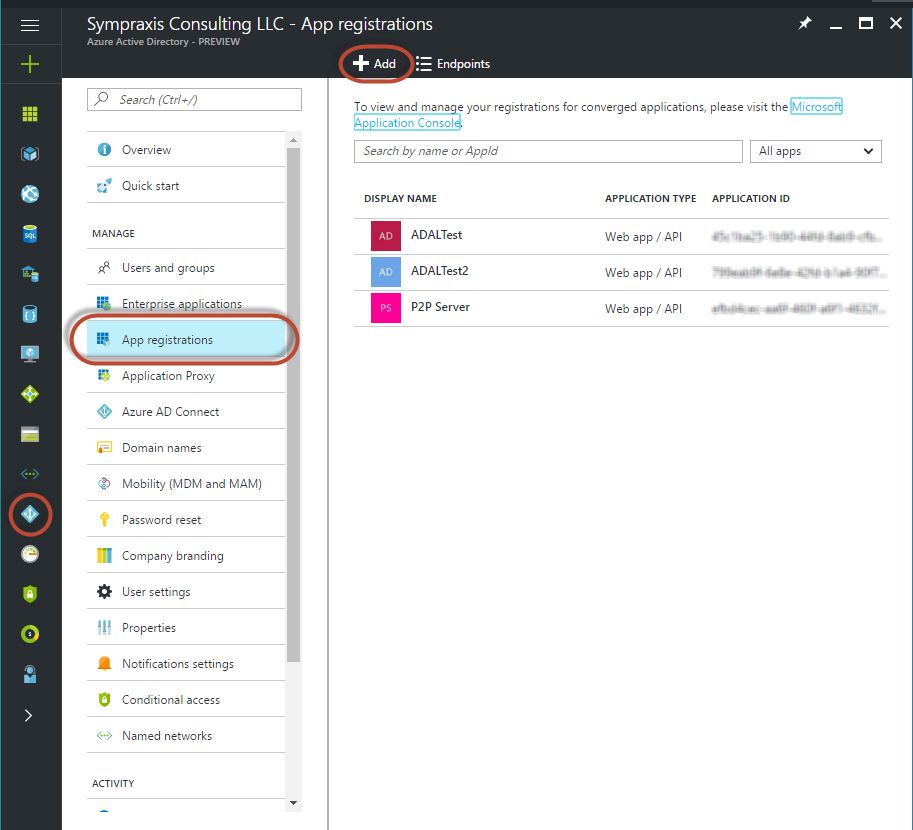
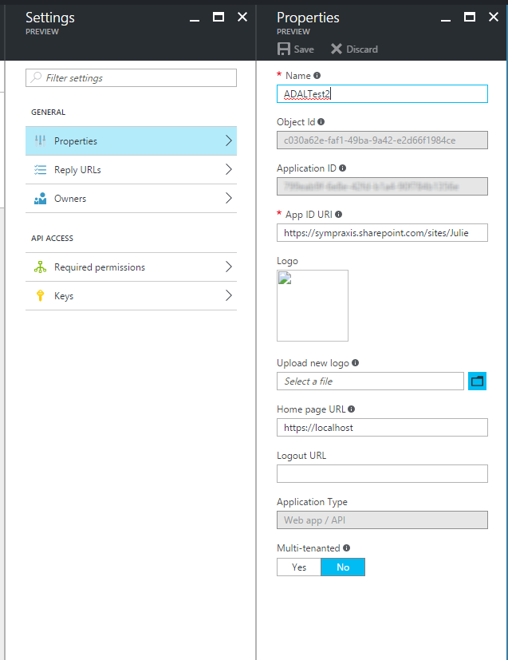
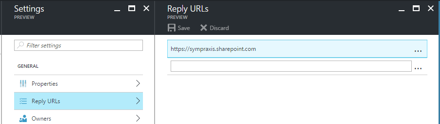
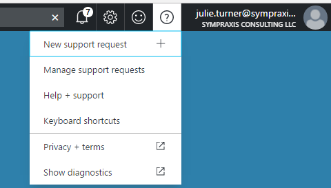
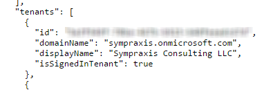
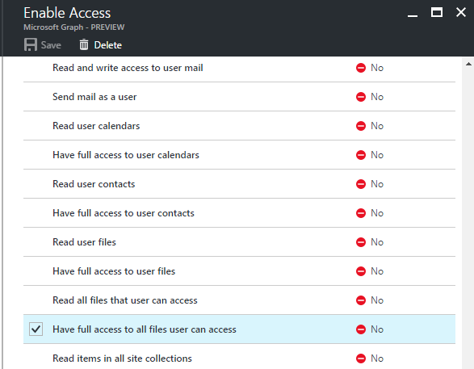
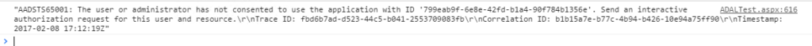
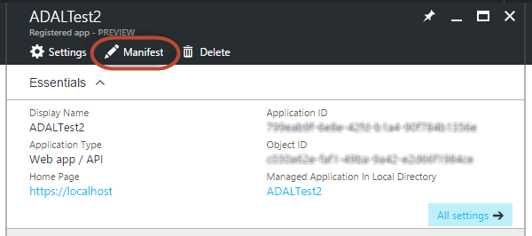

When [Marc](http://sympmarc.com/) and I were at Ignite this past September, #SharePoint was the most tweeted hashtag. We heard a lot about the new SharePoint Framework (SPFx), which was clearly the focus for developers. But another oft-discussed technology topic centered on the expansion of the [Microsoft Graph API](https://graph.microsoft.io/en-us/) (MSGraphAPI). It’s clearly going to be the API of choice going forward to access all Office 365 content, but its maturity is still early days. At Ignite, Microsoft announced the beta endpoints for accessing SharePoint through the Microsoft Graph API. Overall I think this is a good thing, as the API has significantly better adherence to the [OData standard](http://www.odata.org/) compared to the SharePoint REST services. That said, as users of the SharePoint REST services we’re very used to the simplicity of those calls and we literally pay no attention to authentication if we’re operating on SharePoint pages. The tokens we need are already made available right on the page, we just pluck them out, and so there’s little effort. As the features and functionality of the MSGraphAPI leap ahead and we’re trying to extend the SharePoint UI to take advantages of all the new features and functionality, we’re going to have to become comfortable dealing with authentication issues so we can leverage all that power. As I worked to understand all the ways I could utilize the MSGraphAPI I realized that I was collecting a rather lengthy list of resources and reaching out to the various experts I know in the community to get clarification on what I was finding. It seemed appropriate to consolidate that information into a series of blog posts. Part 1 will cover all the background information on Azure Active Directory, authentication methods and flows. Part 2 will go into the SDK library for getting an authorization token. And Part 3 will bring it all together in a demo application that runs as a widget on a SharePoint page, but accesses the MSGraphAPI to create and manipulate an Excel document in a SharePoint library. As we move forward with other solutions based on the MSGraphAPI, I may do additional posts to demonstrate useful techniques. So, let’s begin. Our goal is to access a SharePoint document library and use the Excel API (included in the MSGraphAPI) that will allow us to manipulate Excel files in code. An example use-case for this solution is to generate an “export” of the data you’re tracking on your site so that others can do analysis on it for a data analytics project. Before we write any code, we need to do the following:

1. Select an authentication method
2. Determine the type of flow (small “f”, not the [Flow](https://flow.microsoft.com/) automation tool) you will use to get an access token that you can utilize to authenticate with a resource that trusts Azure Active Directory.
3. Register your application with Azure Active Directory to define your set up and the permissions it needs.
4. Select the SDK library that is right for your project based on the Operating System or Access Application (e.g.., web browser) and development language.

Once that’s done, you can write your application – this is almost the easy part. But first I’ll provide some detail on the steps above.

## Authentication Choices

There are two authentication choices when trying to access the MSGraphAPI from client side code. I’m going to focus here on JavaScript and access specifically for users who are already authenticated in SharePoint. The two authentication providers the MSGraphAPI support are:

* To authenticate users with personal Microsoft accounts, such as live.com or outlook.com accounts, AND authenticate users with enterprise (that is, work or school) accounts, use the Azure Active Directory (Azure AD) v2.0 endpoint.
* To authenticate users with enterprise (that is, work or school) accounts ONLY, use Azure AD.

The second one of these, “authenticating users with enterprise accounts” is the one that is appropriate for our scenario. The “[App Authentication with Microsoft Graph](https://graph.microsoft.io/en-us/docs/authorization/auth_overview)” will walk you through a more extensive decision matrix about which endpoint is right for you, so if you have a more complicated scenario than what I’m focused on, e.g.., authenticating users to your application that isn’t hosted in SharePoint and utilizes live.com or outlook.com accounts, please review that documentation. You’re also going to want to review “[Should I use the v2.0 endoint?](https://docs.microsoft.com/en-us/azure/active-directory/develop/active-directory-v2-limitations#restrictions-on-libraries-amp-sdks)” as well, as there are a significant number of restrictions that may affect you.

## Implicit Flow (aka Implicit Grant Flow)

When you utilize one of the aforementioned authentication choices you need to decide on what type of “flow” you’re going to use. Your choices are “Implicit Grant Flow” or “Authorization Code Grant Flow” or “Client Credentials Grant Flow.” Andrew Connell’s [blog post](http://www.andrewconnell.com/blog/looking-at-the-different-oauth2-flows-supported-in-azuread-for-office-365-apis) on this subject can help you learn more about the three types that are supported. In this case, because of how we’re going to access the MSGraphAPI (via the browser) and the language we’ll use to do it (JavaScript), the decision has been made for us in the sense that the SDK we’re going to utilize forces you to use Implicit Grant Flow. The idea is to get an access token to impersonate a user. However, unlike an authorization code grant flow, instead of requesting an authorization code first, the client is issued the access token directly. The access token has a life of only one hour before it expires and the user would need to request a new token to make additional requests. Why the one-hour expiration? In basic terms because we are operating in a browser, if the access token was always valid, it becomes easier for any other application or user to “steal” said token and access the server without authorization. All the mucking around with tokens and authentication flows is a way to make sites more secure.

## Registering your Application

----------------------------

**Updated Guidance 2/9/2017** – Use the [https://portal.azure.com](https://portal.azure.com) vs <https://manage.windowsazure.com> to create your Application _This section has been re-written to use the newer portal. I was under the impression that by doing so I would be creating an application that was incompatible with ADAL.js… however, based on comments from [John Liu (@johnnliu)](https://twitter.com/johnnliu) as well as a conversation with [Yina Arenas (@yina\_arenas)](https://twitter.com/yina_arenas), Principal Program Manager Lead for the Microsoft Graph, it appears I was misguided. So, my error becomes your gain as I will attempt to completely document creating an application in the new portal that will work with ADAL.js, and has some added benefits to boot as many things are much simpler. That said, one thing remains the same, you still need to have access to the Azure portal for your tenant. Ergo, you’re going to have to find the individual who does and bake them cookies. Maybe a lot of cookies._ After launching the <https://portal.azure.com> site, I navigated to Active Directory, then I clicked on the “App registrations” heading. You can see here that the application I created in the old manage.windowsazure.com is still there (“ADALTest”) and a new one I created for this test called “ADALTest2” has been added - I did so by clicking “Add” at the top.

### Configuration

Once your application is created you need to set the properties and permissions. This is where things are slightly different from creating an application in the old portal. As you can see below you’ll get an “Application ID” assigned automatically. This takes the place of the client key from the old portal, this is confusing if you’ve done this in the old portal, but honestly given were using Implicit Flow it makes a whole lot more sense that you wouldn’t need a client secret because you’re technically not using one. Ok, so what you’ll need to do is give your application and App ID URI, I used the URL of my site collection. This URL can be used only once, so if I wanted to create a second app, I would need to give it a different URI. This is a much bigger discussion regarding governance, and reuse of these applications which I’m not going to go into now, but rest assured I will at some point when I’ve solidified my position.

You will also need to set up a “Reply URL”. In this case, because we will access the application from SharePoint, this needs to just be your SharePoint host name. I will cover the “Required permissions” section below. There’s also an “Owners” section and a “Keys” section. That “Keys” section is what threw me off originally, because in the old portal we used the key it generated as the client id, but as I said in the new portal we use the Application ID.

In addition, you will need your Tenant ID (Guid), in the old portal we got this from the URL, but in the new portal they’ve given us a nice little tool to get it. Go to the top right and click on the “?” and then choose “Show diagnostics”. That will bring up a new page that will show you a JSON object that has a tenant’s section, you’re going to want the guid for your domain’s tenant, although multiple other tenants may show up.

### Permissions

One of the things that can be confusing about setting up your application in Azure AD is configuring the permissions scopes for the application itself. This [article](https://graph.microsoft.io/en-us/docs/authorization/permission_scopes) gives you the full details on setting up the proper permissions based on what you need to access in the MSGraphAPI. It also includes several scenarios. For our scenario, which you’ll see in more detail in [Part 3](http://julieturner.net/2017/01/extending-sharepoint-with-adal-and-the-microsoft-graph-api-part-3-the-execution/), I only needed to grant the application the delegated permission “Have full access to all files user can access”. By default, the application has the “Sign in and read user profile” delegated permission for Windows Azure Active Directory. Since I do some testing by accessing the “me” endpoint, that gives me my user profile information I’m leaving this, but feel free to remove it if you’re not reading the user’s profile. So, you will first “add” the “Microsoft Graph” application to the “Required Permissions” section. Then click on it to see the available application and delegated permissions that can be assigned. The gotcha with permission in the new portal is that after you select the permissions you want and “save” the changes, you then need to do an additional step and “grant” them. You do so by click on the “Grant Permissions” button from the “Required Permissions” page.

If after you’ve gotten through [Part 2](http://julieturner.net/2017/01/extending-sharepoint-with-adal-and-the-microsoft-graph-api-part-2-the-authorization/), you get the error “The user or administrator has not consented to use the application with ID….” in the browser console it most likely means that you forgot to do the “grant” step I outlined above.

### Enabling Implicit Flow

In the new portal, there’s a nice easy way to modify the manifest for your application to allow Implicit Flow. Click on the “Manifest” button for your application. A window will appear that gives you the JSON object that is the applications manifest.

Find the “oauth2AllowImplicitFlow” property and change its value to “true”. Then click “Save”.

## Summary

I hope that this part can help others understand the various building blocks of setting up a client based widget for SharePoint that accesses the MSGraphAPI. In Part 2, we’ll cover the ADAL library and its various configurations to actually get the authorization we need, and then in Part 3, I’ll use everything we’ve covered in Parts 1 and 2 in a demo that will provide a complete end to end solution for creating an Excel file (currently utilizing a third-party JavaScript library as the functionality doesn’t exist yet in the MSGraphAPI), putting that file into a SharePoint library, and changing the data values in it.

## Resources

### OAuth Flows

[Andrew Connell - Looking at the Different OAuth2 Flows Supported in AzureAD for Office 365 APIs](http://www.andrewconnell.com/blog/looking-at-the-different-oauth2-flows-supported-in-azuread-for-office-365-apis) [Microsoft - Integrating applications with Azure Active Directory](https://docs.microsoft.com/en-us/azure/active-directory/develop/active-directory-integrating-applications#updating-an-application) [Matt Velloso - Troubleshooting common Azure Active Directory Errors](http://www.matvelloso.com/2015/01/30/troubleshooting-common-azure-active-directory-errors/) [Microsoft - Should I use the v2.0 endpoint?](https://docs.microsoft.com/en-us/azure/active-directory/develop/active-directory-v2-limitations#restrictions-on-libraries-amp-sdks)

### ADAL

[GitHub - Azure Active Directory Library for JS](https://github.com/AzureAD/azure-activedirectory-library-for-js) [Cloud Identity - Introducing ADAL JS v1](http://www.cloudidentity.com/blog/2015/02/19/introducing-adal-js-v1/) [Cloud Identity - ADAL JavaScript and AngularJS – Deep Dive](http://www.cloudidentity.com/blog/2014/10/28/adal-javascript-and-angularjs-deep-dive/) [Cloud Identity - Getting Acquainted with AuthenticationResult](http://www.cloudidentity.com/blog/2013/09/16/getting-acquainted-with-authenticationresult/) [Cloud Identity - Getting Acquainted with ADAL’s Token Cache](http://www.cloudidentity.com/blog/2013/10/01/getting-acquainted-with-adals-token-cache/) [Microsoft - Call the Microsoft Graph API using OAuth from your web part](https://dev.office.com/sharepoint/docs/spfx/web-parts/guidance/call-microsoft-graph-from-your-web-part)

### Microsoft Graph API (MSGraphAPI)

[Microsoft – Microsoft Graph permission scopes](https://graph.microsoft.io/en-us/docs/authorization/permission_scopes) [Microsoft - App authentication with Microsoft Graph](https://graph.microsoft.io/en-us/docs/authorization/auth_overview)
