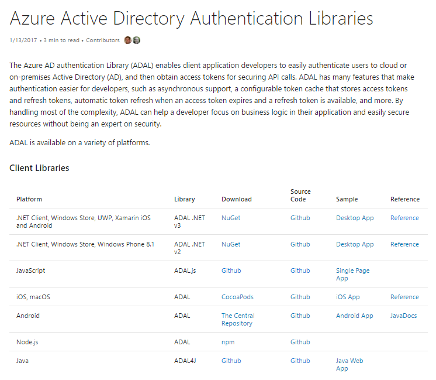

## Introduction

In [Part 1](../extending-sharepoint-with-adal-and-the-microsoft-graph-api-part-1) of this series I covered all the setup needed to start your Microsoft Graph API (MSGraphAPI) client side widget. In Part 2, we’re going to dive into the many ways to use adal.js and its counterpart adal-angular.js. I’ve included the same resources I included in [Part 1](../extending-sharepoint-with-adal-and-the-microsoft-graph-api-part-1), under the section for ADAL you’ll find a lot of references to Cloud Identity blog by Vittorio Bertocci a Principal Program Manager at Microsoft who has blogged extensively on the library, explaining in depth the technical workings of it. I encourage you to read those posts I’ve included below to get a complete understanding of the library. Also, included in the references is a post about utilizing ADAL in the SharePoint Framework (SPFx). As is, ADAL was never meant to be used as part of a widget architecture as ADAL isn’t a singleton, so if you have multiple web parts on your page all referencing ADAL you’re going to have issues. The post “[Call the MSGraphAPI using OAuth from your web part](https://dev.office.com/sharepoint/docs/spfx/web-parts/guidance/call-microsoft-graph-from-your-web-part)” gives you an extension that will help isolate ADAL so that you can utilize it as part of a more strongly developed widget pattern. Since my demo is just that, and since my solution will be the only one running on the page that uses the ADAL library I’m not going to address those modifications here. But, I encourage you do so if that is part of your use case.

## The ADAL library for JavaScript



Finally, we get to the part where we talk about writing some code. ADAL stands for “Active Directory Authentication Library”. Based on the client you’re using and which authentication endpoint you’re using, there are a multitude of different examples and SDK’s available as you can see on the MSGraphAPI, [Getting Started](https://graph.microsoft.io/en-us/docs/get-started/get-started) page. Because we’re going to write client side code (aka JavaScript, either [transpiled](https://en.wikipedia.org/wiki/Source-to-source_compiler) from Typescript or native) and access via Implicit Flow to the MSGraphAPI, we’ll use the adal.js library. It comes in two parts, adal.js and adal-angular.js. If you’re going to use the [AngularJS](https://angularjs.org/) framework, you’ll want both pieces. If not, you can just include adal.js, but there will be more work to do to authenticate and get a token. You can find the source in the [ADAL GitHub](https://github.com/AzureAD/azure-activedirectory-library-for-js) repo.

### User Authentication

One of the things that bothered me was the idea that the user would have to “log in” manually every time the ADAL library would need to authenticate them. In my mind, I envisioned a pop-up that would prompt them for credentials. In the scenario where you’re running this code on your on-premises server in a hybrid scenario, and haven’t set up federated sign-in to your O365 tenant that would be valid, however, in the most likely scenarios I can envision the code would be running in your SharePoint site in your O365 tenant… therefore asking the user to log in again would be annoying at best. Well, sure enough that’s not what happens, the library uses a hidden iframe on the page to make the call to get the user authenticated, since they are technically already authenticated to O365 this is just a matter of “confirming” it for lack of a better term. So, the page does flicker but otherwise this is unnoticeable to the user.

>Note: Thanks to [Wictor Wilen](http://twitter.com/wictor) for bringing up the issue with using adal.js in IE with a trusted site. Please check out this [issue](https://github.com/AzureAD/azure-activedirectory-library-for-js/issues/102), from the GitHub repo.

### ADAL Config

A big part of utilizing the adal.js libraries is to get all the configuration settings correct. I want to highlight some of the configuration properties that I reviewed and what was useful. You’ll see how to put it together and pass it to adal.init() later. The definitions here come straight from the documentation in the adal.js file itself.

* tenant: string - Your target tenant.
* clientID: string - Client ID assigned to your app by Azure Active Directory.
* endpoints: array - Collection of {Endpoint-ResourceId} used for automatically attaching tokens in webApi calls.
* popUp: boolean - Set this to true to enable login in a popup window instead of a full redirect.Defaults to \`false\`.
* cacheLocation: string - Sets browser storage to either 'localStorage' or sessionStorage'. Defaults to 'sessionStorage'.
* anonymousEndpoints: array - Array of keywords or URI's. ADAL will not attach a token to outgoing requests that have these keywords or uri. Defaults to 'null'.

### Using ADAL.js with No Framework

The most tedious coding scenario with ADAL is utilizing it without the AngularJS add-on. I found this [blog article](http://nickvandenheuvel.eu/2016/01/06/authenticate-an-office-365-user-with-adal-js/) on how to do it, but unfortunately for me although it worked initially, when it came time to renew the token the ADAL library was throwing errors. After quite a bit of time on it, reviewing the adal-angular.js file and various other blog posts, I managed to work out a scenario that seems to work reliably. For simplicity's sake, I’m showing an entire html file including the JavaScript in one code snippet. I commented the code extensively but in a nutshell, we’ll do the following:

* **1.** For simplicity code is executed on page load using jQuery's document.ready function. The goal of that bit of code is to determine if AAD is doing a callback and if so, let the adal.js library handle it.
  * **a.** If not a callback, check if the user is authenticated, if not, call the ADAL login function
  * **b.** If not a callback, and user is authenticated, then execute any initialization code we want to run.
* **2.** When a call needs to be made against the MSGraphAPI, e.g., the sympraxis.getGraphData function, first get the token by calling the sympraxis.getAuthToken function (which returns a promise since it may need to make an asynchronous call to AAD, and if so we need to wait until that completes.
  * **a.** If the token is in the cache, return it by resolving he promise.
  * **b.** If the token is not in the cache, acquire a new one and then resolve the promise with the new token.
* **3.** Make the REST call to the MSGraphAPI and include the token in the header.

```html
<script src="https://cdnjs.cloudflare.com/ajax/libs/jquery/3.1.1/jquery.min.js"></script>
<script src="https://secure.aadcdn.microsoftonline-p.com/lib/1.0.13/js/adal.min.js"></script>

<div>
  <h1>My Great ADAL Test</h1>
  <div id="message"></div>
  <br/>
  <div id="displayName"></div>
  <div id="jobTitle"></div>
  <div id="mail"></div>
  <div id="mobilePhone"></div>
  <div id="officeLocation"></div>
</div>

<script type="text/javascript">
  "use strict";
  var sympraxis = window.sympraxis || {};
  sympraxis.clientId = '<client id guid>';
  sympraxis.tenant = '<tenant guid>';

  sympraxis.config = {
      tenant: sympraxis.tenant,
      clientId: sympraxis.clientId,
      endpoints: {
          graphUri: 'https://graph.microsoft.com'
      },
      cacheLocation: "localStorage"
  };
  //Create the autentication context
  sympraxis.authContext =  new AuthenticationContext(sympraxis.config);

  sympraxis.getAuthToken = function(endpoint){
      var d = jQuery.Deferred();
      
      //Read the token from the cache
      var tokenCache = sympraxis.authContext.getCachedToken(endpoint);

      if(tokenCache == undefined) {
          //If token is undefined, then call AAD to get a new token
          sympraxis.authContext.acquireToken(endpoint, function (error, token) {
              if (error || !token) {
                  d.reject(error);
              }
              else {
                  d.resolve(token);
              }
          });
      }else{
          d.resolve(tokenCache);
      }
      //Return a promise for acquiring token
      return d.promise();
  };

  sympraxis.getGraphData = function(){
      //Get the token, either from the cache or from the server
      var tokenPromise = sympraxis.getAuthToken(sympraxis.config.endpoints.graphUri);
      tokenPromise.then(function(token){
          //Promise for token resolved
          if(token != undefined) {
              //Valid token, make a REST call to the MSGraphAPI
              var meUri = "https://graph.microsoft.com/v1.0/me";
              $.ajax
              ({
                  type: "GET",
                  url: meUri,
                  headers: {
                      //Include the token
                      "Authorization": "Bearer " + token
                  }
              }).done(function (response) {
                  $("#message").text("Got the data.");
                  $("#displayName").text(response.displayName);
                  $("#jobTitle").text(response.jobTitle);
                  $("#mail").text(response.mail);
                  $("#mobilePhone").text(response.mobilePhone);
                  $("#officeLocation").text(response.officeLocation);
              }).fail(function () {
                  $("#message").text("Failed to get the data.");
              });
          }
      }, function(error){console.log(JSON.stringify(error));});
  };

  $(document).ready(function() {
      // Check For & Handle Redirect From AAD After Login or Acquiring Token
      var isCallback = sympraxis.authContext.isCallback(window.location.hash);

      if (isCallback && !sympraxis.authContext.getLoginError()) {        
          sympraxis.authContext.handleWindowCallback(window.location.hash);
      }else{
          var user = sympraxis.authContext.getCachedUser();
          if (!user) {
              //Log in user
              sympraxis.authContext.login();
          }else{
              sympraxis.getGraphData();
          }
      }
              
  });
</script>
```

### Using Angular 1.x framework with ngRoute

If you’re a fan of the AngularJS framework, then the adal-angular.js library does all the heavy lifting for you. It extends both AngularJS’s $http provider and the ngRoute directive. It adds the bearer token that was retrieved using the adal.js library to the $httpProvider in your REST calls for you. In addition, it accepts an additional configuration setting on each of your routes which determines whether AD login should be required or not. If set to true, when you navigate to the particular route, the adal-angular.js library makes sure the user is logged in, and then also makes sure the $httpProvider appends the token. If it’s not set - or set to false - then the token will not be appended to the $http calls. Also, note here that I’ve utilized html5Mode on the $locationProvider. I did that because of a recommendation in the documentation that indicated that having it on fixes issues with endless callbacks. I too found this to be an issue, but only when bypassing ngRoute. For safety, I put it in both examples, but I'll leave it to you to test whether it’s necessary in your solution or not. So, at this point I’m sure you can see that this scenario is significantly simplified from our “No Framework” version above. Other than the changes to the .config, no other changes are necessary. You just go about your business making $http calls and the adal-angular.js library does the rest .

```javascript
sympraxis.adaltestapp = angular.module('ADALTestApp', \['ngRoute','AdalAngular'\])
.config(\['$routeProvider', '$httpProvider', 'adalAuthenticationServiceProvider', '$locationProvider',
function ($routeProvider, $httpProvider, adalProvider, $locationProvider) {
  $locationProvider.html5Mode({
      enabled: true,
      requireBase: false
  }).hashPrefix('!');
  
  $routeProvider.when("/", {
      controller: "ADALTestCtrl",
      templateUrl: "/sites/Julie/\_catalogs/masterpage/\_ADALTest/html/adaltestview.html",
      requireADLogin: true
  }).otherwise({ redirectTo: "/" });

  adalProvider.init(
      {
          tenant: '',
          clientId: '',
          endpoints: {
              'https://graph.microsoft.com': 'https://graph.microsoft.com'
          },
          cacheLocation: "localStorage"
      },
      $httpProvider);
}\]);

```

### Angular 1.5+ using Components

Angular version 1.5 introduced a new concept called “Components” which was viewed widely as a superior architectural strategy for building Angular applications. So much so a very similar schema was adopted for Angular 2. With components, you generally do not use ngRoute. Further, with many [widget solutions](http://julieturner.net/2016/01/widget-wrangler/), routing is overkill. So, we need to consider another strategy for managing when the $http provider should include the token and, because ngRoute was making sure the user is authenticated for us (as I noted in the previous section), we’re going to need to handle that as well.

For authentication, we’ll reuse the concepts we discussed in the “No Framework” section by making sure on page load we trap the callback and allow the ADAL.js library to handle it. Because this is a component there is the handy $onInit() function. That will work perfectly for our needs.

Now to handle server calls that are not meant to have the token amended… enter, anonymousEndpoints. In this scenario, our configuration would not include the $routeProvider. Instead we would include relative URLs we want to ignore when making $http calls. In this case I included two anonymous endpoints, one for the location of my component templates, and the other is the SharePoint REST APIs.

```javascript
sympraxis.adaltestapp = angular.module('ADALTestApp', \['AdalAngular'\])
.config(\['$httpProvider', 'adalAuthenticationServiceProvider', '$locationProvider',
  function ($routeProvider, $httpProvider, adalProvider, $locationProvider) {
    $locationProvider.html5Mode({
        enabled: true,
        requireBase: false
    }).hashPrefix('!');

    adalProvider.init(
        {
            tenant: '5a3f949f-70ba-467b-b915-b40feeadc67d',
            clientId: '45c1ba25-1b90-44fd-8ab9-cfb2f45920e8',
            endpoints: {
                'https://graph.microsoft.com': 'https://graph.microsoft.com'
            },
            cacheLocation: "localStorage",
            //endpoints you want ADAL to ignore, they are inclusive paths, also you must use relative paths, if you include http/https it will look for a resource and automatically append the token of the loginResource
            anonymousEndpoints: \['/sites/CDN/Samples/GraphExcel/', '/sites/Julie/\_api/'\]
        },
        $httpProvider
    );
  }\])
.constant("\_CONFIG", {
    "ONEDRIVE\_EP":"https://graph.microsoft.com/v1.0/me/drive/",
    "SP\_EP":"https://graph.microsoft.com/beta/sharepoint/sites/78f3f43c-7845-4273-8be7-f253552a173f/lists/7bc97907-9a6c-4959-9474-946d854a81a8/drive/"
  }
);

```

I specified relative URLs in the anonymousEndpoints array we want to ignore because if you review the code that decides if the $http call should append the bearer token to it, you can see that if the URL includes http or https it will try to find a matching endpoint. If it does not find one, it will utilize the token that was used for the login resource. For example, if you try to make a call against the SharePoint REST API and the URL you use includes <https://mytenant.sharepoint.com> it’s going to append the bearer token and subsequently fail. Also, note that I only included the root of the URLs I want ADAL to ignore. That is because the test for anonymous endpoint uses a “contains” check.

The controller for the component we create would then define an $onInit() function that would handle login for those components that need it. There are certainly other ways architecturally to handle this, but I wanted to keep things simple so I wouldn't lose the point in the elegance of the architecture. At a baseline this is what it would look like. We’re going to expand on this, and explain the SP\_EP url in the \_CONFIG in Part 3.

```javascript
function geController($http, $q, adalProvider, \_CONFIG) {
  var vm = this;
  var adalAuthContext = new AuthenticationContext(adalProvider.config);

  vm.$onInit = function() {
    var isCallback = adalAuthContext.isCallback(window.location.hash);
    if (isCallback && !adalAuthContext.getLoginError()) {
        adalAuthContext.handleWindowCallback();
    }
    else {
        var user = adalAuthContext.getCachedUser();
        if (!user) {
            //Log in user
            adalAuthContext.login();
        }
    }
  };
}

```

## Summary

Now we’ve completed Part 2, you should have everything you need to go off and start making calls to the MSGraphAPI. But, if you’re interested, [Part 3](http://julieturner.net/2017/01/extending-sharepoint-with-adal-and-the-microsoft-graph-api-part-3-the-execution/) will bring all of this together and show you how to create an Excel spreadsheet from scratch, add it to a SharePoint document library, and then manipulate it with the Excel API’s. Please stay tuned...

## Resources

### OAuth Flows

[Andrew Connell - Looking at the Different OAuth2 Flows Supported in AzureAD for Office 365 APIs](http://www.andrewconnell.com/blog/looking-at-the-different-oauth2-flows-supported-in-azuread-for-office-365-apis) [Microsoft - Integrating applications with Azure Active Directory](https://docs.microsoft.com/en-us/azure/active-directory/develop/active-directory-integrating-applications#updating-an-application) [Matt Velloso - Troubleshooting common Azure Active Directory Errors](http://www.matvelloso.com/2015/01/30/troubleshooting-common-azure-active-directory-errors/) [Microsoft - Should I use the v2.0 endpoint?](https://docs.microsoft.com/en-us/azure/active-directory/develop/active-directory-v2-limitations#restrictions-on-libraries-amp-sdks)

### ADAL

[GitHub - Azure Active Directory Library for JS](https://github.com/AzureAD/azure-activedirectory-library-for-js) [Cloud Identity - Introducing ADAL JS v1](http://www.cloudidentity.com/blog/2015/02/19/introducing-adal-js-v1/) [Cloud Identity - ADAL JavaScript and AngularJS – Deep Dive](http://www.cloudidentity.com/blog/2014/10/28/adal-javascript-and-angularjs-deep-dive/) [Cloud Identity - Getting Acquainted with AuthenticationResult](http://www.cloudidentity.com/blog/2013/09/16/getting-acquainted-with-authenticationresult/) [Cloud Identity - Getting Acquainted with ADAL’s Token Cache](http://www.cloudidentity.com/blog/2013/10/01/getting-acquainted-with-adals-token-cache/) [Microsoft - Call the Microsoft Graph API using OAuth from your web part](https://dev.office.com/sharepoint/docs/spfx/web-parts/guidance/call-microsoft-graph-from-your-web-part)

### Microsoft Graph API

[Microsoft – Microsoft Graph permission scopes](https://graph.microsoft.io/en-us/docs/authorization/permission_scopes) [Microsoft - App authentication with Microsoft Graph](https://graph.microsoft.io/en-us/docs/authorization/auth_overview)
