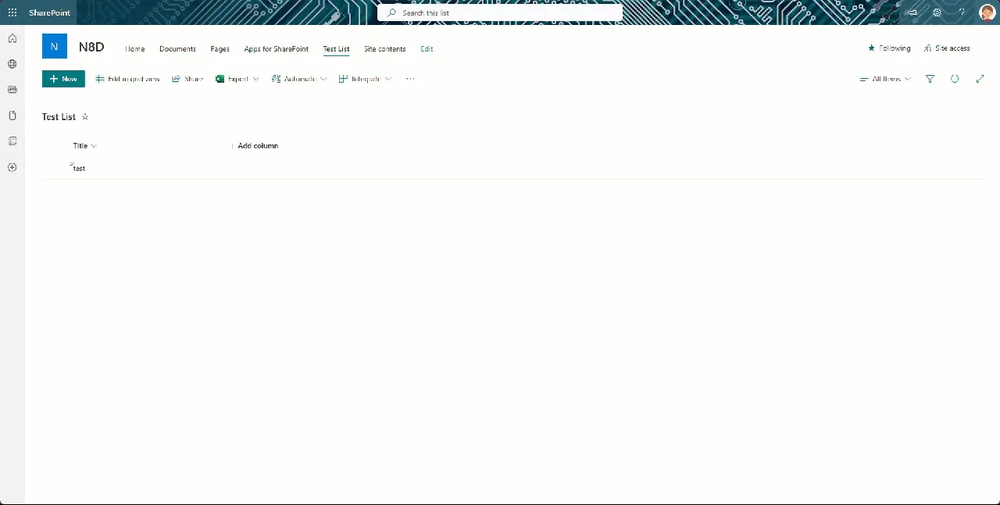

In my [last post](../htwoo-210-dialogs/) I announced the implementation of the native html dialog element in hTWOo-Core and the corresponding component in the hTWOo-React library.

> hTWOo is a pure html and css implementation of Microsoft Fluent Design. hTWOo-React is a ReactJS wrapper for hTWOo-Core.

This post started with a question posted in [sp-dev-docs](https://github.com/SharePoint/sp-dev-docs/issues) that [Stefan Bauer](https://n8d.at/blog) pointed out to me. It's a really good question and I felt like others might benefit. Essentially the OP was stuck on how to use ReactJS in a SharePoint Framework Extension that by default doesn't give you an option for using a framework. In general for basic scenarios you probably wouldn't need a framework so I totally understand why that's the case, however, sometimes you want to do more and so this demo will show you how.

Below is a visual of exactly what we're trying to accomplish. Obviously this is a very primitive implementation. The key here is to remember that you have complete control over the elements inside the dialog. When you combine that surface with your own custom code and maybe some REST calls using [PnPjs](../getting-started-pnpjs/) -- shameless plug -- you can really build some extremely powerful user interfaces.



## Implementation

The following show the baseline code needed to loading a ReactJS component into the DOM when a command button is pressed. This is part of the root .ts file, in the sample, `CmdDialogCommandSet.ts`. When the button is pressed it calls `_openDialog` when then loads the `DialogCont` into the provided DOM element.

```ts
private _openDialog(): void {
  try {
    if (this._docConfigElement == undefined) {

      //create approval container div
      this._docConfigElement = document.createElement("DIV") as HTMLDivElement;
      this._docConfigElement.className = styles.cmdDialogRoot;
      this._docConfigElement.setAttribute("id", this._docConfigContId);
      this._docConfigElement.className = styles.cmdDialogRoot;
      this._docConfigElement.style.position = "relative";
      this._docConfigElement.style.display = "block";

      this._spfxThemes.initThemeHandler(this._docConfigElement, undefined, undefined, true);

      //bind to top placeholder
      document.body.appendChild(this._docConfigElement);
    }

    const props: IDialogContProps = {
      closeForm: this._closeConfigForm
    };
    const dialogCont: React.ReactElement<{}> = React.createElement(DialogCont, props);
    ReactDOM.render(dialogCont, this._docConfigElement);
  } catch (err) {
    console.error(`${this.LOG_SOURCE} (_openConfigForm) - ${err}`);
  }
}

private _closeConfigForm = (): void => {
  if (this._docConfigElement !== undefined) {
    ReactDOM.unmountComponentAtNode(this._docConfigElement);
  }
}
```

For the DialogCont component itself, it's a fairly simple implementation just to get you started. Here's a quick look at the `render` method.

```ts
public render(): React.ReactElement<IDialogContProps> {
  try {
    return (
      <div data-component={this.LOG_SOURCE}>
        <HOODialog type={HOODialogType.SidebarRight} width="30vw" visible={true} changeVisibility={this.props.closeForm}>
          <HOODialogHeader
            closeIconName="hoo-icon-close"
            closeOnClick={this.props.closeForm}
            title="Sidebar Dialog Title Area"
            closeDisabled={false} />
          <HOODialogContent>
            <p>This area would contain your UI for whatever interactions you need to support.</p>
          </HOODialogContent>
        </HOODialog>
      </div>
    );
  } catch (err) {
    console.error(`${this.LOG_SOURCE} (render) - ${err}`);
    return null;
  }
}
```

## Full Solution

I've [shared the full working solution](https://github.com/juliemturner/Public-Samples/tree/main/hTWOoDialogCommand) in my public GitHub repository which would can download and even install in your own tenant -- although might I suggest a [dev tenant](../dev-tenant/) if that's your plan and you don't already have one. All you need to do is clone it and then you can build the SPFx solution and check it out for yourself.

For more information on hTWOo-React check out our [documentation](https://lab.n8d.studio/htwoo/htwoo-react/?path=/docs/introduction-getting-started--docs). For an overview of hTWOo please see this [previous post](../intro-htwoo-react/) or visit our [hTWOo page](https://lab.n8d.studio/htwoo/).

Happy Coding!
