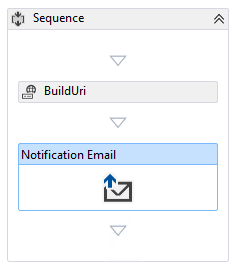
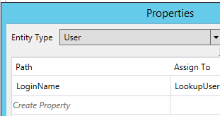

When building a custom SharePoint 2013 Workflow using [Visual Studio](http://www.microsoft.com/visualstudio) I ran into a very odd problem trying to send a notification email to a group of users using the Email action (specifically Microsoft.SharePoint.DesignTime.Activities.Email).

I could send email from a SharePoint 2013 workflow created using SharePoint Designer, but could not do the same from my custom workflow created in Visual Studio without the workflow throwing an error.  I’m not even going to post the error because as it turns out it’s a generic error message that could show up for any number of reasons and has little to nothing to do with the problem which was partially why it took so long to solve.

My colleague Bob German ([Blog](http://bob1german.com/) ~ twitter: [@Bob1German](https://twitter.com/Bob1German)) gave me an assist debugging and testing out the issue… By using [Fiddler](http://www.telerik.com/fiddler), set up to run on my [SharePoint server](http://en.wikipedia.org/wiki/Microsoft_SharePoint "Microsoft SharePoint") under the Workflow Manager App Pool account, I was able to see why the call works from a SharePoint Designer workflow but not my custom VS2013 workflow. What I found was that when the call was made from the SharePoint Designer workflow, the “To” address was in the form of the users login name and not the email address.  So even though the [documentation](https://msdn.microsoft.com/EN-US/library/office/microsoft.sharepoint.workflowservices.activities.email_members.aspx) states that the “To” property _“Gets or sets the user names or email addresses that represent the recipients of the email message.”_, that is apparently not entirely the case.  By tweaking the value I pulled from the LookupSPUser activity from Email to LoginName and adding that value to the recipient’s collection, everything worked beautifully.



As an aside, from this same Fiddler investigation, I also found that the SharePoint Designer email action formats the body as an HTML message and if you want to use that you can by embedding your body in between the following tags:

```html
<HTML>
  <HEAD> 
    <META name=GENERATOR content=\\"MSHTML 11.00.9600.17924\\">
  </HEAD>
  <BODY>
    <FONT face="Segoe UI">
      <Email Body Here>
    </FONT>
  </BODY>
</HTML>
```
