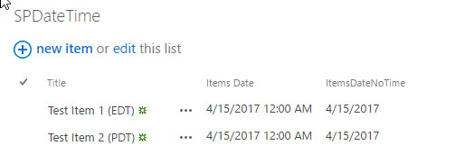
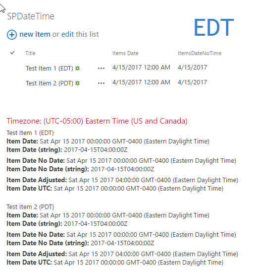
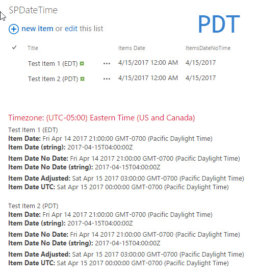
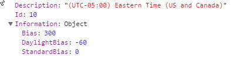

If you develop client side solutions for SharePoint you’ve either run into this or you will run into the following scenario. SharePoint stores all its date/time fields in UTC time. The site collections, sites, and the users, can have their own time zone settings. If you’re using SharePoint out of the box because all the content is rendered on the server and pushed to the client with all the date/time translation has been done for you. This makes wonderful sense, except when you try and write JavaScript against those same data points. The REST endpoints that return the data for you give you the date string in a format that is specific to the regional settings of the person asking for them. Sadly, this doesn’t translate as well to JavaScript as you might like. I’ve set up a scenario to illustrate the point with a couple of manipulations you can make depending on your desired goals.

## Scenario

I have two PC’s (ok, one is virtual 😊). I set my virtual machine’s time zone to Pacific Daylight Time (PDT) and my main machine is set to Eastern Daylight Time (EDT). Then I have a SharePoint site collection whose regional settings are set for Eastern Time (or UTC-5:00 aka EDT). I created a list with a title field, and two date fields one to show date/time and one to show just date. The date only field was to illustrate that the problem exists regardless of whether the user intentionally sets the time or not. I created an item in the list from my computer set to Eastern time… Then I went to my computer set to Pacific time and created a second item. I set the dates and times for both items the same from their respective UIs. Again, this is to illustrate that the local time of the computer has no bearing on what SharePoint sees the date/time as. Regardless of who entered the item the dates are displayed based on the regional settings effective on the site.



I’ve written some code that I’m going to expose using a CEWP… the code does the following things:

1. Read the regional settings of the site.
2. Gets all the items in my SPDateTime list and loops through them, for each item…
3. Get the Items Date field, create a JavaScript date object, display the date object and the string that was used to create it.
4. Get the Items Date No Time field, create a JavaScript date object, display the date object and the string that was used to create it.
5. Adjust the Items Date field into the time zone of the regional settings in effect on the server and display it.
6. Adjust the Items Date field into UTC time and display it.

Ok, so let’s start with the computer in EDT and take a look at what our client side code does:



What you’re probably noticing right away is that everything looks great. It’s just what you’d expect. So, what’s the problem… well… if you’re developing client side code and all the time zone settings for all of your users and their computers are going to be in the same time zone… absolutely no problem at all. The tricky part begins when we look at the computer where the time zone of the computer is set to PDT.



Ok, so what happened here is that when the date strings were passed into JavaScripts Date() function, the browser is actually then converting that date into the local time of the computer. So 4/15/2017 12:00 am becomes 4/14/2017 9:00 pm (3 hours earlier). Again, this makes perfect sense, but if you want the user to experience dates independent of time zone, you’re in trouble. This can often happen if you’re building SharePoint “applications” date/times as fixed points in time that will be used as comparators. Ok, so let’s look at a couple of workarounds and depending on your scenario you’ll have to decide if either of them work for you. I’m not going to go into how those regional/personal settings work but I will provide you a link to where
[Gregory Zelfond](https://twitter.com/gregoryzelfond), gives a nice explanation: [Setting proper SharePoint Time Zone for users](http://sharepointmaven.com/sharepoint-time-zone/).

## Adjust date to time zone of “server”

The first manipulation I made was to adjust the date field to the time zone of the “server”, when I say server I mean whatever regional setting is in effect for that “page”. I personally can’t come up with a ton of scenarios where this is useful with the exception of making comparisons. In our PDT example which changes 4/15/2017 12:00 am to 4/15/2017 3:00am, which would be midnight PDT. I readily admit this is an odd scenario but you may need it (I actually have).

## Adjust to UTC time zone

The second, which I think is entirely more useful, is converting to UTC time which basically means were going to ignore the time zone entirely. So, for our scenario this means 4/15/2017 12:00am shows up as 4/15/2017 12:00am.

## The Code

For this solution, we’re going to need to make two REST calls the first will be to get the regional time zone of the web we’re working in. To do that you need to make a GET request to: **/\_api/Web/RegionalSettings/TimeZone** The response for this call is the following, where we will use the Bias, and DaylightBias to calculate the region the server is operating in so we can mimic the values the server displays:



The second is to get all the items in our test list. Below is the code to generate the various date/time values I outlined above. Keep in mind, this is only a small code snippet from inside the loop that is traversing the items returned from out afore mentioned list. \*Assume that **data** is an array of responses

```javascript
itm.datetimestring = data\[i\].ItemsDate;
//Create a date from the returned date/time field
itm.itemsdatetime = new Date(data\[i\].ItemsDate);
//Get a time representation of that date in milliseconds 
var localTime = itm.itemsdatetime.getTime();
//Get the regional time offset based on the REST call to /\_api/Web/RegionalSettings/TimeZone
//value is in minutes, must be converted to milliseconds
var regionTimeoffset = (SPDV.TimeZone.Information.Bias + SPDV.TimeZone.Information.DaylightBias) \* 60000;
//Get the local time offset based on the date object
//value is in minutes, must be converted to milliseconds
var localTimeoffset =  itm.itemsdatetime.getTimezoneOffset() \* 60000;
//Create a new date object in the target field
itm.adjusteddate = new Date();
//Set the value of that date object to the original item plus 2x the difference between the local time zone offset and the regional time zone offset
itm.adjusteddate.setTime(localTime + ((localTimeoffset-regionTimeoffset) \* 2 ));
//Create a new date object in the target field
itm.utcdate = new Date();
//Set the value of the date object to the original item plus the difference between the local time zone offset and the regional time zone offset.
itm.utcdate.setTime(localTime + (localTimeoffset-regionTimeoffset));
```

For the full code sample, you can go to my [github](https://github.com/juliemturner/Public-Samples) repo and look in the SPDateTime folder.

For completeness sake, I should mention that if you’re going to be doing a lot of date/time manipulation it might make sense to utilize the [moment.js](https://momentjs.com/) library which makes a bunch of this stuff significantly simpler. I tend to be a minimalist when it comes to libraries, only using one when I have use for it. But if it makes you more efficient by all means don’t be a martyr and reinvent the wheel.

Hope this can help a few people out there struggling with date/times in SharePoint client side solutions. Happy Coding!
