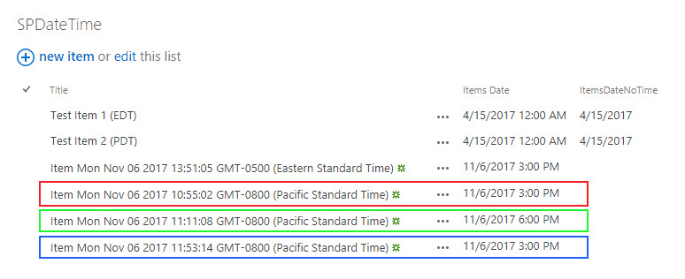

A recent comment on my blog post “[SharePoint time, is not your time, is not their time.](../sharepoint-datetime)” has prompted me to create a short addendum post that specifically references updates and how your thinking might differ from displaying SharePoint date/time values. To recap our example, I was discussing how to manipulate the date values to have your client-side code mimic (or not) the regional settings of your SharePoint site. The question was raised about how to deal with dates when doing POST to a SharePoint list or library from your client-side code.

The answer, as usual, is it depends. It depends on what exactly you want to have happen. Your choices are to ignore the time zone entirely and assume that people entering data into your site are working within the time zone of that site. Your second option is to convert the date/time from the user’s local time zone and have it converted to match the site they’re on. In this scenario the user would enter a time such as 3pm PST and if the site collection’s regional settings are EST then the date that would be saved would be converted to 6pm.

Compared to the hoops we had to jump through for displaying the time, this can potentially be significantly easier, but it would depend on how you're collecting your dates. So let me show you an example.



Note the image above. The first two entries are from our previous blog post, so we’ll ignore those. The next one titled _“Item Mon Nov 06…. (Eastern Standard Time)”_ was the first test done with the time zone setting of the computer left at EST which matches the sites regional settings\*. In almost any way we would POST these dates they're going to work out ok, so I'm going to ignore that scenario. The next three entries are the interesting ones. After changing the OS's time zone to PST I then did REST POST call to create a new record in that list, the entry outlined with a red box. The date/time I used was the string value of the input box that I set to 11/6/2013 3:00 PM. In code that values looked like:

```cmd
2017-11-06T15:00
```

The second POST to the list used a string value of the input box but after I converted that string value to a JavaScript Date object, ergo the value looked like:

```cmd
2017-11-06T23:00:00.000Z
```

Which is UTC +8 hours for the PST offset. I didn’t do anything fancy to make this happen I simply assigned the JSON object that would be in my POST payload to the date object and then the call to JSON.stringify function uses the toISOString() to convert the Date object into a string, ergo the date being passed to SharePoint is in UTC.

```typescript
var newDate = document.getElementById("newDateTimeLocal").value;
var itemDate = new Date(newDate);
var item = {Title: "Item " + (new Date()).toString(), ItemsDate: itemDate};
```

So, finally what happens if I have a date object but you want the first result, which was the result of passing a string without the time zone information. That’s where you have to go back to our regional trickery and manipulate the time by the offset. So, in the third entry, outlined in blue, I set the time to be offset by the regionalOffset – localOffset.

```typescript
var localTime = itemDate.getTime();
var regionTimeoffset = (SPDV.TimeZone.Information.Bias + SPDV.TimeZone.Information.StandardBias) \* 60000;
var localTimeoffset =  itemDate.getTimezoneOffset() \* 60000;
itemDate.setTime(localTime + (regionTimeoffset-localTimeoffset));
```

Hopefully that add a bit more clarity to your options. Happy coding!

>Regional settings for the site collection are set to Eastern Time, the original blog post was written when we were in daylight savings time and so the code reflected adjustments for that. Currently the clocks have switched and we’re in eastern standard time ergo I’m going to use the StandardBias (which is 0) instead of the DaylightBias._
