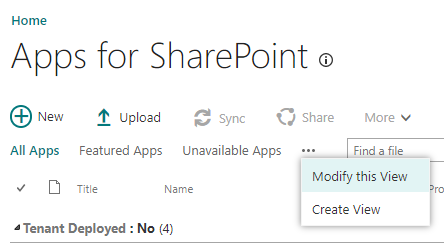

After several years of building SharePoint Framework solutions on an almost daily basis you get to the point where you’ve managed to find some things that work pretty well. I recently started a new project and after sharing them with the team realized that maybe these tips would be useful to others and so thought to consolidate them into a list.

## Change the default view for the tenant app catalog

Probably not the oddest, but certainly in a top 10 oddest OOB settings in SharePoint, is the list view settings for the default view in the tenant app catalog for SharePoint apps which groups by Product ID. Definitely, a head scratcher. Luckily, the catalog is just a plain old (and still classic) SharePoint library. Depending on which type of app catalog (tenant or site collection) and what I’m using it for I have a couple of different go-to views. For the tenant app catalog, I like to change the grouping from the "Product ID" field to the "Tenant Deployed" field and also sort by "Title" so that I can easily find a solution to check its version\* or status.



Also, did you know that you can "disable" a solution... yeah me either. This is especially useful for application customizers that you're not currently working on and don't want to have the overhead of running on the page if you're not serving it. If you "Edit" the solution in the tenant app catalog you can set the enabled property to \`false\` and it will no longer be loaded. So, it some of my development site collections I'll change the view to group by "Enabled" to group what solutions I have ready to go and which I need to enable before I can start working on them again. _\*Note on version. Unless you’re using the feature framework or changing something in one of the configuration files, the version of the solution (that is the version listed in package-solution.json) doesn't really affect anything. Regardless, I think it’s immensely useful in tracking what versions are deployed where, so I encourage it’s use in conjunction with the package.json version number. The pnp/spfx-generator has [a very nice "version feature"](https://pnp.github.io/generator-spfx/usage/#npm-version) that helps keep them all in sync, even if you don’t use the PnP generator, I recommend appropriating that feature and implementing it in your solution._

## Create a developer build

If you’re an SPFx user you’re accustomed to the command: \`gulp clean & gulp bundle --ship & gulp package-solution --ship\` Did you know that if you leave the --ship off the bundle and package-solution commands you get what I like to refer to as a "developer build"? Effectively it means that the build pipeline creates your manifest and the solution package (.sppkg) but internally the manifest is looking for your solution to be running on localhost, exactly like it is when using the workbench. If you then deploy that package, you will be able to add web parts to pages, or view application customizers without having to play around with query string parameters which saves a lot of time and headaches.

## If you can’t use a developer tenant, use a site collection app catalog... maybe use one anyway

From a previous post you know I ([and Todd Klindt](https://www.toddklindt.com/blog/Lists/Posts/Post.aspx?ID=884)) are huge proponents of the development tenant. When building solutions, especially web parts or single app part solutions where everything is self-contained (i.e. doesn’t need to pull information from various other areas in the tenant) this is a great choice. However, often you’ll be working on solutions that need to collate information from across your SharePoint environment or the entire tenant and you quickly get to a point that you need realistic data to validate your solution is working as expected. Enter, site collection app catalog. If you’re not familiar with them [site collection app catalogs](https://docs.microsoft.com/en-us/sharepoint/dev/general-development/site-collection-app-catalog) are a very useful feature. I occasionally use them for production solutions when the solution is a one off "app" that will only be deployed in one site collection. There is a bit of a governance issue in that it’s not exactly obvious to everyone what site collections have an app catalog, that said, there is an somewhat hidden OOB way to find them:

`https://<tenant-app-catalog-URL>/Lists/SiteCollectionAppCatalogs/AllItems.aspx\`

As a developer a site collection app catalog has another use. It turns out that if you deploy a solution (even a tenant wide deployed solution) to a site collection app catalog that is also deployed in the tenant app catalog the site collection app catalog version will take precedence. You get several benefits from this “feature”

* Gives you granular control
* Allows you to develop against a production solution
* Gives you a way to do ALM lite... combine this with CI/CD processes using GitHub actions or AzureDevOps pipelines and it’s not bad for a shoestring solution

Ok, so let’s break these down. By creating "developer" site collections and corresponding site collection app catalogs you can effectively create little working silos for developers to continue to develop against production information without necessarily affecting that information. I only really recommend this for "consume" scenarios but many of the solutions I build fall into that category, and this becomes a very useful way to build and test a solution before deploying it as you can see what it's really going to look like. Another use case for additional site collections and corresponding app catalogs is a "lite" version of a CI/CD pipeline. In addition to development silos, you can also create site collections meant for QA, staging, etc. and create a simple GitHub action to build and deploy the packages into those site collections for that purpose.

Here is an example, you might have a tenant wide deployed application customizer that builds a global navigation solution for a tenant. Version 1.0 is in production, and you need to make some modifications. You have two developers working on distinctive features of the solution. You want to have a QA step where select users review the solution and validate that it’s working properly and then you want a staging environment where you can verify that only the exact features are being deployed to production. You’re storing all your code in a private GitHub repo. For the GitHub repo you would have a main branch, plus a dev branch (or dev branch with feature branches) and then a branch for QA and a branch for staging. In SharePoint you would create a dev site, a QA site, and a staging site and for each of those sites you would enable a site collection app catalog. Starting with the dev branch you would version the package.json and the package-solution.json based on whatever semantic version makes sense based on the update, let’s assume a minor update so the updated version will be 1.1. Now create a development build of that solution and deploy it to the site collection app catalog in the development site.

Now both developers can work on the code, running gulp serve to view how their solution is behaving in the development site collection. When the features are ready for QA the code can be merged onto the QA branch and a production build (including the --ship switch) can be deployed to the QA site’s site collection app catalog. Similarly, when QA is complete the code can be merged into the staging branch and a production build can be deployed to the staging site collection app catalog for final review before finally merging the code base back to the main branch for production deployment. You go one step further by creating a simple GitHub action on merge into the QA and staging branch that can automatically deploy the _sppkg_ into the site collection app catalog taking out the manual process of redeploying them. Unless you have some manual approval intervention, I might avoid creating an automatic deployment to production as it’s too easy to accidentally merge into the wrong branch thus breaking production. I’ve included a really simple example of the .yml file below.

## Sample CI/CD GitHub action

```yml
name: Build and Deploy SPFX packages to QA environment

on: 
  push: 
    branches: 
      qa

jobs:
  build-and-deploy-webpart:
    runs-on: ubuntu-latest

    defaults:
      run:
        working-directory: ./
    
    steps:
    - name: Checkout code
      uses: actions/checkout@v2
      
    - name: Use Node.js
      uses: actions/setup-node@v1
      with:
        node-version: 10.x
    
    - name: Install from package-lock.json
      run: |
        npm ci
  
    - name: package
      run: |
        gulp dist

    - name: Office 365 CLI Login
      uses: pnp/action-cli-login@v1.0.0
      with:
        ADMIN\_USERNAME:  ${{ secrets.SHAREPOINT\_UID }}
        ADMIN\_PASSWORD:  ${{ secrets.SHAREPOINT\_PASSWORD }}

    - name: Deploy to locations-dev app catalog
      uses: pnp/action-cli-deploy@v1.0.0
      with:
        APP\_FILE\_PATH: sharepoint/solution/my-webpart.sppkg
        OVERWRITE: true
        SCOPE: sitecollection
        SITE\_COLLECTION\_URL: https://contoso.sharepoint.com/sites/myQASite
```

I hope all these ideas helps others streamline and simplify their SharePoint Framework development lives. Happy Coding!
