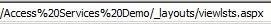
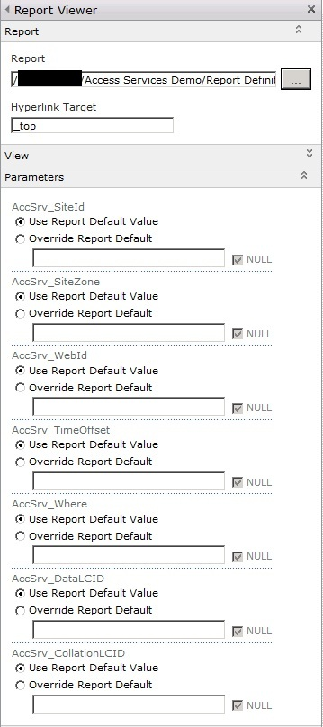
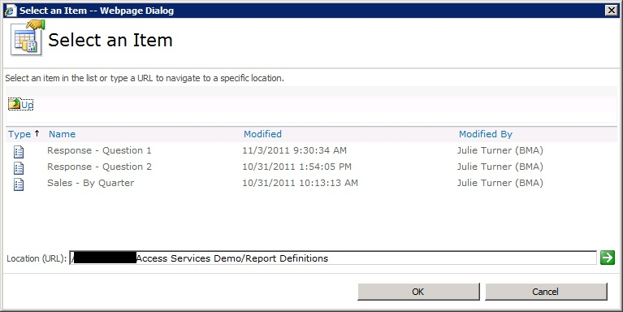
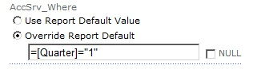
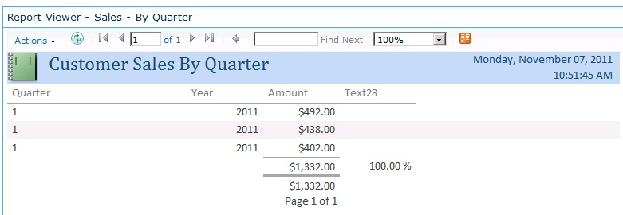
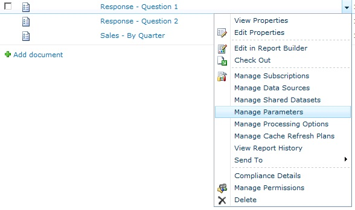

As you may or may not be aware when an Access database is published to a SharePoint site the reports in the database are converted into SQL Reporting Services reports.  Great, you think... that should mean you can host the report elsewhere in the SharePoint higherarchy simply by using the SQL Reporting Services Report Viewer Web Part.  And in fact, you can, it's just a little tricky getting it configured.  Certainly not anything you can't overcome but hopefully by posting this information it'll help save some time.

So first, we need to create the page that we're going to put our report on.  Next, you're going to want to insert a SQL Reporting Services Report Viewer Web Part.  And finally, we need to configure it, which includes setting the location of the report as well as any report aparameters.

## Configuring the Web Part

The first step is to set the report that the Web Part should display.  To do that you need the URL to the rdl file that represents the Access report.  To get that, browse to the SharePoint site hosting the Access application.  Next, manually change the URL after the site name to show all site content.  You do this by appending "\_layouts/viewlsts.aspx" after the site which should look something like the following where "Access Services Demo" is the name of my SharePoint site:

  

Now in the listing of the site's contents you'll see a document library called Report Definitions.  Browse to that library and you'll see all your Access Reports defined there.  Now, go back to the web part properties.  As shown below click on the ellipses of the Report parameter and then put in the URL of the report definition document library.

When you click the green arrow it will load a list of the reports available in that library.  Select the one you want to display and click OK.

Now, back in the web part properties expand the parameters section and click on Load Parameters.

In Access Services all reports have the following parameters:

* AccSrv\_SiteId: This is the GUID of the root site collection.
* AccSrv\_SiteZone: Default
* AccSrv\_WebId: This is the GUID of the site hosting the Access application
* AccSrv\_TimeOffset: TimeZone offset
* AccSrv\_Where: A where clause for the report
* AccSrv\_DataLCID: The Data Language Reference ID (1033 is the English Default)
* AccSrv\_CollationLCID: The collation Language Reference ID (2070 is the English Default)

I have found that for most reports setting the AccSrv\_SiteId and AccSrv\_WebId are all that is necessary for the report to generate properly.  However, under certain circumstances where there was summation and grouping in the report I've had to set the DataLCID value to 1033 (the default for English).  All the other values can be left to use the report default.

>There are many ways to get the GUID for a site but I find the quickest way is to use a tool like SharePoint Manager 2010.

If you have the need to adjust the Where parameter of the report keep in mind that you need to pass the entire where clause as you would type it in the filter parameter of the report if you were working in Access.  You also must include a beginning "=" sign.

For instance the following "Where" clause limits the report to those records where the value of the \[Quarter\] field is equal to 1.  (Even though \[Quarter\] is a numeric field I still have to pass it as a string).

  
  
And then here's what the report looks like when rendered:

If you want to pass the Where clause in using a Query String filter you can do that but you'll first need to modify the parameter of the report by going back to the Report Definition library, and modifying the parameters of the report so that the AccSrv\_Where parameter is changed to "Prompt" instead of hidden.  The only downside is that the report shows the user the where clause when it's rendered but this can be overcome by using a little JQuery script to hide the `
` that shows in the report.

Note also in the above screen shot that one of the option is "Edit in Report Builder".  If you don't have a complex report you can modify the report definition using this SQL Report Builder tool, which is downloaded for you automatically.  This was how I initially determined the values of some of the parameters by showing them in the header and then running the report from within the Access UI on the SharePoint site.
