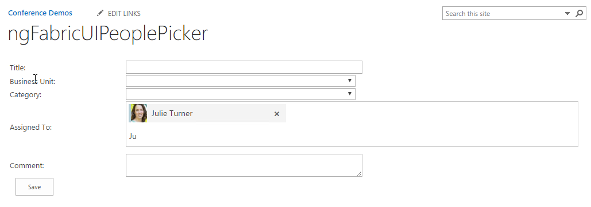

One of the great _joys_ of developing custom forms in SharePoint is developing the controls for some of the more complicated field types, specifically the Taxonomy Picker and the People Picker. If you’re sensing sarcasm, you would be correct. There are brave souls out there who recreated these components for us that utilize no less than five (and sometimes more) Microsoft Javascript libraries. The reality is, for the People Picker, which is what I’m going to be discussing today, you’re really looking for a type ahead input field that filters a list of people that you can retrieve from SharePoint. Sounds easy right… \*sigh\* if only.

If you've started using the new SharePoint Framework (SPFx) there is a big push to use the [OfficeUIFabric](https://dev.office.com/fabric). This framework provides not only styling but components that mimic what we’re given out of the box. Unfortunately, if you’re not a [React](https://facebook.github.io/react/) framework user it seems that the investment by Microsoft is significantly lacking. I suppose this makes sense. Regardless, a team of non-Microsoft people embarked on a community project to create an AngularJS version of this library, [ngOfficeUIFabric](http://ngofficeuifabric.com/). Although it has some issues, overall it seems to work pretty well, but given it took me a bit to figure out what does and doesn’t work and exactly the best way to wire it up I thought I’d share my findings. This is where you can find the online [demo](http://ngofficeuifabric.com/demos/uifPeoplePicker/) for the people picker.

The idea, is to provide a function that either returns a list of people that match the query string (or not, there really is no requirement) or a promise to return a list of people. It supports Angular’s ng-model directive as well as ng-disabled. Obvious missing components are the ability to specify whether the field should be multiselect or not (it’s always multiselect), and the ability to trigger any functions on selection or selection change, I believe this is potentially a bug. Never fear dear reader, we can get around these limitations for the most part and the ability to avoid seventeen million additional libraries is a huge plus. Further, the architecture will certainly work in modern… so for all you brave SPFx coders out there you can take the same principles and apply them to the React component or even this Angular component depending on which framework (you want to use).

Ok, let’s get down to brass tacks…

## Data Source

The people picker component wants an array of objects with the following attributes. We’ll call that object “Person”

```javascript
var Person = { initials: null, primaryText: null, secondaryText: null, presence: null, group: null, color: null, icon: null, id: null};
```

| Attribute | Description |
| -- | -- |
| initials | Used in lieu of a users picture with a background color. |
| primaryText | The primary display text identifier of the user/group. |
| secondaryText | Some secondary information you want to highlight about the user/group. |
| presence | Text value, available options are available,  busy,  away,  blocked,  dnd,  offline |
| group | The results group you want to display the person in when the results of the search are displayed.  This takes the form of an object with the following properties { name: "Results", order: 0 } |
| color | If there is no image, this will be the background color for the users “Initials” block.  Available options are lightBlue,  blue,  darkBlue,  teal,  lightGreen,  green,  darkGreen,  lightPink,  pink,  magenta,  purple,  black,  orange,  red,  darkRed |
| icon | This is the URL to a thumbnail image of the user, if provided this will be used in lieu of the initials and color attribute. |
| id | Ideally this would be the id for the user in your site collection, but in lieu of that it’s a good option to use the users account name, or fully qualified domain name. |

Now that we understand what structure the data needs to take, we need to go get it. To my mind there are two ways to solve this problem, the first, and probably the easiest would be to use Search. By which I mean the [Search REST endpoint](https://dev.office.com/sharepoint/docs/general-development/sharepoint-search-rest-api-overview) in SharePoint. That will be the direction I’ll take for this post, that said, you could always leverage my previous [posts](http://julieturner.net/series/extending-sharepoint-with-adal-and-the-microsoft-graph-api/) on utilizing the Microsoft Graph API inside SharePoint and use that to get the results. That would have the distinct advantage of being able to provide significantly more interesting information about the user if you needed it.. like manager assuming your user data is complete and up to date {insert plug for [Hyperfish](https://hyperfish.com/) here}.

>Note: NGFPP.currentSite is the url for the current site collection

```javascript
function getPerson(id, name, accountName, department, pictureUrl){
   var newPerson = {initials: null, primaryText: null, secondaryText: null, presence: null, group: null, color: null, icon: null, id: null};
   //My results group name will be called ‘Results’ for all the people found by search
   var resultsGroup = { name: "Results", order: 0 };
   //Use a regex to get an array of the first letters of the users names
   var userInitials = name.match(/\\b\\w/g) || \[\];
   //Create a string of the initials
   var userInitialsResult = ((userInitials.shift() || '') + (userInitials.pop() || '')).toUpperCase();
   newPerson.initials = userInitialsResult;
   newPerson.primaryText = name;
   //This could be whatever you want
   newPerson.secondaryText = department;
   //Since I don't have real information I felt offline was the best policy
   newPerson.presence = 'offline';
   newPerson.group = resultsGroup;
   //I just like orange, you may want to randomize the available choices
   newPerson.color = 'orange';
   if(pictureUrl != undefined && pictureUrl.length > 0)
       newPerson.icon = pictureUrl;
   //If you have the id, use it, otherwise you'll need to resolve the account name.
   newPerson.id = id || accountName;
   return newPerson;
}

var getPeopleSearch = function (queryString) {
   var d = $q.defer();

   $http({
       method: 'GET',
       headers: {
           'Content-Type': 'application/json;odata=verbose',
           'accept': 'application/json;odata=verbose',
       },
       url: NGFPP.currentSite + "/\_api/search/query?querytext='" + queryString + "\*'&sourceid='B09A7990-05EA-4AF9-81EF-EDFAB16C4E31'"
   }).then((result) => {
       if(result.data.d.query.PrimaryQueryResult.RelevantResults.Table.Rows.results == undefined) {d.resolve(\[\]);}
           var queryResults = result.data.d.query.PrimaryQueryResult.RelevantResults.Table.Rows.results;
           if(queryResults.length > 0){
               var searchResult = \[\];
               var formattedPeople = \[\];
               //AccountName //Department //Path //PictureURL //PreferredName
               for(var i=0; i < queryResults.length; i++){
                   // Normalize the fields so that we can easily get the values by the key name
                   for(var j=0; j < queryResults\[i\].Cells.results.length; j++){
                       searchResult\[queryResults\[i\].Cells.results\[j\].Key\] = queryResults\[i\].Cells.results\[j\].Value;
                   }
                  //Create a new person object with the resulting values
                   var newPerson = getPerson(null, searchResult.PreferredName, searchResult.AccountName, searchResult.Department, searchResult.PictureURL);
           //Add the new person to the results array
                  formattedPeople.push(newPerson);
               }
               //Return the results array
               d.resolve(formattedPeople);
           }
       },
       function (error) {
           console.log("Error retrieving user search.", {Error: JSON.stringify(error.data)});
           d.reject(error);
       });
   return d.promise;
};
```

Now, as you can see from a Search query I’m not going to be able to get the user's id which would be needed to set the value of a person field. In this scenario, I’m specifically attempting to get all the available users from our directory, not only the ones that have actually logged into our SharePoint site. So, before I’ll be able to create/update an item in a list I’ll need to convert that person’s id (account name) into an actual id from the hidden users list in the Site Collection. For that we can use the [ensureuser](https://msdn.microsoft.com/en-us/library/office/dn499819.aspx#bk_WebEnsureUser) REST endpoint which is analogous to its CSOM cousin.

```javascript
var ensureUser = function(userName) {
    var data = {logonName: userName};
    return $http({
        method: 'POST',
        headers: {
            "Content-Type": "application/json;odata=verbose",
            "Accept": "application/json;odata=verbose",
            "X-RequestDigest": document.getElementById("\_\_REQUESTDIGEST")\['value'\]
        },
        data: JSON.stringify(data),
        url:  NGFPP.currentSite + "/\_api/web/ensureuser"
    });
}
```

## UI

Now that we have all the back-end pieces put together we can get started with the user interface. The one bug that I still haven’t completely solved is that of a wrapping issue, you can see it in the screenshot below. I suspect that the issue is related to various SharePoint css attributes and I just haven’t found the right one to override. But it’s trivial so I’ve decided to move on without solving it for now. Eventually I’m going to get it!



Since I’m on the topic let’s start with a couple minor CSS overrides you’ll want to include within your form. I’d strongly suggest scoping them to your form as well as you wouldn’t want to upset SharePoint styling elsewhere.

```css
.ms-PeoplePicker input\[type=button\], .ms-PeoplePicker input\[type=reset\], .ms-PeoplePicker input\[type=submit\], button {
    min-width: 0;
    padding: inherit;
    margin-left: 0;
    border: 0;
}

.ms-PeoplePicker .ms-PeoplePicker-searchField {
    padding: 2px 5px;
    border: 0;
}
```

Now onto the HTML, here’s a small snippet of a table that I created for the “form”. I’m only showing the row for the People Picker in it. Of note, uif-people is linked to a variable on my controller that is assigned the function and the ng-model is linked to an empty array that can receive the selected “Person” items from the source array. In my example, I’ve decided to use the compact type and include a search delay… these are options and I’d encourage you to look over the [demo’s](http://ngofficeuifabric.com/demos/uifPeoplePicker/) to decide what’s right for you.

```html
<tr>
    <td>Assigned To:</td>
    <td>
        <uif-people-picker uif-people="vm.getPeopleSearchResults" ng-model="vm.Issue.AssignedTo" uif-type="compact" uif-search-delay="300"
            placeholder="Search Sympraxis Employees">
            <uif-people-search-more>
                <uif-primary-text uif-search-for-text="You are searching for: ">Search Sympraxis employees
                </uif-primary-text>
            </uif-people-search-more>
        </uif-people-picker>
    </td>
</tr>
```

### Controller

```javascript
function myAppCtrl($timeout, $q, ngfppService) {
    var self = this;
    //The Model
    self.Issue = {Title: null, BusinessUnit: null, Category: null, AssignedToId: null, AssignedTo: \[\], Status: 'New', Comment: null};
    //Function to get search results for the query value
    self.getPeopleSearchResults = function(query) {
        //If no query string then just return empty array
        if((query == undefined) || query.length < 1) return \[\];
        let d = $q.defer();

        ngfppService.getPeopleSearch(query).then(function (result){
            //resolve the search results
            d.resolve(result);
        });
        //return a promise
        return d.promise;
    };

    //Function to save the new item.
    self.save = function() {
        //Call the ensureuser REST Endpoint for the value of the people picker field 
        ngfppService.ensureUser(self.Issue.AssignedTo\[0\].id).then(function(result){
            //Assign the resulting Id, to the person fields internal Id field
            self.Issue.AssignedToId = result.data.d.Id;
            delete self.Issue.AssignedTo;
            //Call the save function
            return ngfppService.saveIssue(self.Issue);
        })
        .then(function(result) {
            self.Issue = {Title: null, BusinessUnit: null, Category: null, AssignedToId: null, AssignedTo: \[\], Status: 'New', Comment: null};
        });
    }
}
```

## Single User Hack

One of the missing components of the solution is the ability to limit the user to selecting only one value. The work around I came up with, which I completely admit is a hack, was to implement a $watchCollection. This way when I see the model change I can determine if more than one item is selected and if so replace the originally selected item with the newly selected item. I’ve found in implementation this looks very smooth to the user so I’m happy with it as a work around. To add this to the above controller you would do the following:

```javascript
$scope.$watchCollection(() => {return this.Issue.AssignedTo;}, (newValue, oldValue) => {
    if (newValue !== oldValue) {
        if (newValue.length > 1)
            this.Issue.AssignedTo = \[newValue\[(newValue.length - 1)\]\];
    }
});
```

## Summary

So even with its flaws I’m moving forward with the implementation simply because it feels like a significantly cleaner solution. If someone out there takes this on and solves the css issues before I do PLEASE let me know and I’ll update the post with your solution. Hopefully I’ll figure it out soon!

## Resources

The complete code is available on my [GitHub](https://github.com/juliemturner/Public-Samples) repo if you’re interested in looking at the complete solution.
